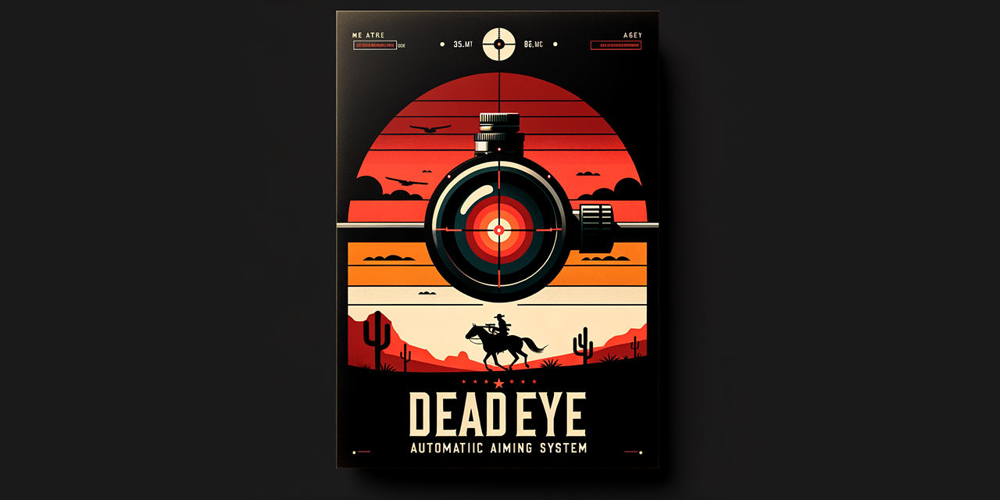

# DeadEye 辅助瞄准系统 / DeadEye Auto Aiming System



DeadEye 目标追踪系统是一款高性能的图像辅助目标追踪工具。作为示例，提供了在FPS游戏中的目标追踪以及对应的瞄准效果演示。示例程序通过分析屏幕截图，检测并追踪目标，最后通过模拟操作实现辅助瞄准和自动扳机功能。不仅如此，我还将这个系统应用在光学激光控制和监控探头的目标追踪中，虽然这些领域的示例程序没有提供，但用户可以通过简单修改相关模块，将这个系统应用于不同领域。

DeadEye target tracking system is a high-performance image-assisted target tracking tool. As an example, it provides a demonstration of target tracking and corresponding aiming effects in FPS games. The sample program analyzes screenshots, detects and tracks targets, and finally implements assisted aiming and automatic trigger functions through simulated operations. Additionally, I have applied this system to optical laser control and monitoring target tracking. Although sample programs for these fields are not provided, users can apply this system in different domains by simply modifying the corresponding modules.

## 特性

- **高速截图**: 使用 ScreenShotHelper 类快速截取屏幕图像，并自动适配不同的屏幕分辨率。
- **目标检测**: 目标检测 YoloDetector 类继承于 DetectModule 基类，基于 Yolov8 目标检测神经网络，支持基于 `.pt` 权重文件的直接检测或使用 TensorRT 部署后的 `.trt` / `.engine` 模型进行精确的目标检测。
- **目标追踪**: 结合匈牙利算法和卡尔曼滤波优化目标追踪的精确性和稳定性。
- **辅助瞄准**: 辅助瞄准模块 DeadEyeAutoAimingModule 类继承于 AutoAimModule 基类，利用 PID 控制算法实现平滑的辅助瞄准。
- **易于扩展**: 用户可以根据需求定制自己的图像输入模块、目标检测模块、后处理（辅助瞄准）模块以及驱动控制模块（鼠标控制或其他）。
- **多语言UI**: 具有简单直观的用户界面,支持英文和简体中文两种语言,用户可以方便地切换语言或者增加新的语言支持。

## Features

- **High-speed Screenshot**: Uses the ScreenShotHelper class to quickly capture screen images and automatically adapts to different screen resolutions.
- **Target Detection**: The target detection class YoloDetector is derived from the base class DetectModule. It is based on the Yolov8 target detection neural network and supports direct detection using `.pt` weight files or precise target detection using deployed TensorRT models with `.trt` / `.engine` formats.
- **Target Tracking**: Combines the Hungarian algorithm and Kalman filter to optimize the accuracy and stability of target tracking.
- **Assist Aiming**: The DeadEyeAutoAimingModule class, inheriting from the AutoAimModule base class, uses PID control algorithms to achieve smooth assist aiming.
- **Easy to Extend**: Users can customize their own image input module, target detection module, post-processing (assisted aiming) module and drive control module (mouse control or other) according to their needs.
- **Multi-language UI**: Features a simple and intuitive user interface that supports both English and Simplified Chinese. Users can easily switch between languages or add support for new languages.


## 技术路线

### 相机模块 (BaseCamera)
作为示例实现了一个快速的截图相机 `SimpleScreenShotCamera` ，可以快速获取指定大小的屏幕截图，用户可以自己实现自己的相机类并在 `main.py` 中的 `main` 函数里实例化并传入至 `DeadEyeCore` 中。
- **自动分辨率计算**: 自动检测屏幕分辨率并调整截图尺寸适应不同大小的窗口需求。
- **高速截图**: 采用 `dxcam` 或 `mss` 实现高速截图功能。
- **定制扩展**：你只需要继承 `BaseCamera` 类并且实现 `get_image()` 函数返回恰当的图像就可以自定义你的相机了。


### 目标检测模块 (DetectModule)
作为示例实现了一个基于 `Yolov8` 进行目标检测的 `YoloDetector` 类，用户可以自己实现自己的目标检测类，只需要保证输出的格式为 list<list<c, x, y, w, h>> 即可。
- **YoloDetector 类**: 可以使用 `.pt` 模型进行直接检测，也支持使用 `.trt` / `.engine` 模型的基于 TensorRT 的部署方式进行高效检测。

### 目标追踪
- **目标类 (Target)**: 基于检测结果，使用匈牙利算法进行帧间目标匹配和编号，此外使用卡尔曼滤波算法对目标位置进行预测和优化，以实现平滑的追踪效果。

### 瞄准模块 (AutoAimModule)
作为示例实现了一个 `DeadEyeAutoAimingModule` 类，支持使用 PID 算法进行瞄准。
- **定制扩展**: 允许用户继承或修改基类，创建个性化的辅助瞄准模块。

### 鼠标控制模块（MouseControlModule）
- **SimpleMouseController**: 鼠标控制类实例， `DeadEyeAutoAimingModule` 类会在 `__init__` 时实例化这个类并用这个类来控制鼠标。用户需要自己实现这个类里控制鼠标两个函数 `click_left_button` 以及 `move_mouse` ，分别对应点击鼠标左键以及移动鼠标。
- **定制扩展**: 用户可以自由实现这个类，即可轻松使用树莓派或其他设备来控制鼠标，此外，作者并没有为用户实现这个类的两个控制鼠标的函数功能以及其他硬件操控功能，用户编程实现后对应的法律风险需要用户自己承担。

## Technological Path

### Camera Module (BaseCamera)
An example implementation of a quick screenshot camera, `SimpleScreenShotCamera`, is provided. This camera can quickly capture screenshots of a specified size. Users can implement their own camera class and instantiate it in the `main` function of `main.py`, then pass it to `DeadEyeCore`.
- **Automatic Resolution Calculation**: Automatically detects screen resolution and adjusts the screenshot size to accommodate different window requirements.
- **High-Speed Screenshot**: Utilizes `dxcam` or `mss` to achieve high-speed screenshot functionality.
- **Custom Extensions**: To customize your camera, simply inherit from the `BaseCamera` class and implement the `get_image()` function to return the appropriate image.

### Target Detection Module (DetectModule)
An example implementation of target detection based on `Yolov8` is provided with the `YoloDetector` class. Users can implement their own target detection class, as long as the output format is `list<list<c, x, y, w, h>>`.
- **YoloDetector Class**: Can use `.pt` models for direct detection and also supports efficient detection using `.trt` / `.engine` models through TensorRT deployment.

### Target Tracking
- **Inter-Frame Matching**: Utilizes the Hungarian algorithm for consistent target matching across frames, ensuring reliable tracking.
- **Position Prediction and Optimization**: Employs Kalman filter algorithms to predict and optimize target positions, resulting in smoother tracking and better performance.

### Auto Aim Module (AutoAimModule)
An example implementation is provided with the `DeadEyeAutoAimingModule` class, which supports aiming using the PID algorithm.
- **Custom Extensions**: Allows users to inherit or modify the base class to create personalized aiming assistance modules.

### Mouse control module (MouseControlModule)
- **SimpleMouseController**: Mouse control class instance. The `DeadEyeAutoAimingModule` class will instantiate this class during `__init__` and use this class to control the mouse. Users need to implement the two mouse control functions in this class, `click_left_button` and `move_mouse`, which correspond to clicking the left mouse button and moving the mouse respectively.
- **Customized Extension**: Users can freely implement this class, and can easily use Raspberry Pi or other devices to control the mouse. In addition, the author has not implemented the two mouse control functions and other hardware of this class for users. The corresponding legal risks after the control function and user programming are implemented need to be borne by the user himself.

## 使用指南

### 运行程序

1. 执行 `main.py` 文件启动程序，操作UI或使用快捷键进行识别系统的暂停、继续或者开启自动瞄准、自动扳机等。
2. 程序运行中可以使用以下默认快捷键：
   - `P` : 暂停/继续程序
   - `O` : 完全结束程序
   - `鼠标左键` : 按下时开启自动瞄准

## Usage Guide

### Running the Program

1. Execute the `main.py` file to start the program. Use the UI or hotkeys to pause, resume, or enable features like auto-aiming and auto-triggering.
2. While the program is running, you can use the following default hotkeys:
   - `P` : Pause/Resume the program
   - `O` : Completely exit the program
   - `Left Mouse Button` : Enable auto-aiming while pressed

### 效果演示

以下动图展示了此项目可提供的辅助瞄准效果：

### Demonstration

The following animation demonstrates the aiming assist effect provided by this project:


### 注意事项

- **注1**：此项目是从之前损坏的项目代码中整合而来，部分功能缺失。
- **注2**：本项目是一个使用屏幕图像基于目标检测网络进行辅助瞄准的程序，仅作为课程项目，供学习和研究测试使用。严禁将本项目用于游戏作弊、盈利等任何可能涉嫌违法的用途。本程序不提供对鼠标、键盘等输入设备的任何直接控制或互动的代码。其他使用者需要在严格遵守AGPL-3.0许可协议的前提下，合法合规地借鉴本仓库的源代码，不得进行任何违法行为。如有任何违法行为发生，与本项目作者无关，作者保留依法追究相关责任人法律责任的权利。
- **注3**：2024.4.25，项目已修复了绝大多数错误，并且更换目标检测模块至 Yolov8 版本，使用 .pt 以及 .trt 权重文件进行目标检测并且辅助瞄准测试无误。

### Precautions

- **Note 1**: This project is integrated from previously damaged project code and some functions were lost.
- **Note 2**: This project is a program that uses screen images based on an object detection network for assisted aiming, solely as a course project for learning and research testing purposes. It is strictly prohibited to use this project for any potentially illegal purposes such as game cheating or profiteering. This program does not provide any code for direct control or interaction with input devices such as mice and keyboards. Other users must strictly comply with the AGPL-3.0 license agreement and legally and compliantly reference the source code of this repository, and must not engage in any illegal activities. If any illegal activities occur, they are unrelated to the author of this project, and the author reserves the right to legally pursue the legal responsibility of relevant responsible persons.
- **Note 3**: As of April 25, 2024, the project has fixed most of the errors and has updated the target detection module to the Yolov8 version. It now uses the .pt and .trt weight file for target detection, and the assisted aiming has been tested without issues.

### 常见问题

1. TensorRT类

   `FileNotFoundError: Could not find: nvinfer.dll. Is it on your PATH?`

   `FileNotFoundError: Could not find: cudnn64_8.dll. Is it on your PATH?`

   `Could not find module 'C:\...\nvinfer_plugin.dll`

   解决方式在 `TensorRTEngine.py` 开头注释中给出。

2. dxcam类

   `AttributeError: module 'dxcam' has no attribute 'output_res'. Did you mean: 'output_info'?`

   请使用以下代码替换 `dxcam` 中的 `__init__` 文件
   ```python
   import weakref
   import time
   from dxcam.dxcam import DXCamera, Output, Device
   from dxcam.util.io import (
      enum_dxgi_adapters,
      get_output_metadata,
   )


   class Singleton(type):
      _instances = {}

      def __call__(cls, *args, **kwargs):
         if cls not in cls._instances:
               cls._instances[cls] = super(Singleton, cls).__call__(*args, **kwargs)
         else:
               print(f"Only 1 instance of {cls.__name__} is allowed.")

         return cls._instances[cls]


   class DXFactory(metaclass=Singleton):

      _camera_instances = weakref.WeakValueDictionary()

      def __init__(self) -> None:
         p_adapters = enum_dxgi_adapters()
         self.devices, self.outputs = [], []
         for p_adapter in p_adapters:
               device = Device(p_adapter)
               p_outputs = device.enum_outputs()
               if len(p_outputs) != 0:
                  self.devices.append(device)
                  self.outputs.append([Output(p_output) for p_output in p_outputs])
         self.output_metadata = get_output_metadata()

      def create(
         self,
         device_idx: int = 0,
         output_idx: int = None,
         region: tuple = None,
         output_color: str = "RGB",
         max_buffer_len: int = 64,
      ):
         device = self.devices[device_idx]
         if output_idx is None:
               # Select Primary Output
               output_idx = [
                  idx
                  for idx, metadata in enumerate(
                     self.output_metadata.get(output.devicename)
                     for output in self.outputs[device_idx]
                  )
                  if metadata[1]
               ][0]
         instance_key = (device_idx, output_idx)
         if instance_key in self._camera_instances:
               print(
                  "".join(
                     (
                           f"You already created a DXCamera Instance for Device {device_idx}--Output {output_idx}!\n",
                           "Returning the existed instance...\n",
                           "To change capture parameters you can manually delete the old object using `del obj`.",
                     )
                  )
               )
               return self._camera_instances[instance_key]

         output = self.outputs[device_idx][output_idx]
         output.update_desc()
         camera = DXCamera(
               output=output,
               device=device,
               region=region,
               output_color=output_color,
               max_buffer_len=max_buffer_len,
         )
         self._camera_instances[instance_key] = camera
         time.sleep(0.1)  # Fix for https://github.com/ra1nty/DXcam/issues/31
         return camera

      def device_info(self) -> str:
         ret = ""
         for idx, device in enumerate(self.devices):
               ret += f"Device[{idx}]:{device}\n"
         return ret

      def output_info(self) -> str:
         ret = ""
         for didx, outputs in enumerate(self.outputs):
               for idx, output in enumerate(outputs):
                  ret += f"Device[{didx}] Output[{idx}]: "
                  ret += f"Res:{output.resolution} Rot:{output.rotation_angle}"
                  ret += f" Primary:{self.output_metadata.get(output.devicename)[1]}\n"
         return ret

      def output_res(self):
         res = []
         for didx, outputs in enumerate(self.outputs):
               for idx, output in enumerate(outputs):
                  res.append(output.resolution)
         return res

      def clean_up(self):
         for _, camera in self._camera_instances.items():
               camera.release()


   __factory = DXFactory()


   def create(
      device_idx: int = 0,
      output_idx: int = None,
      region: tuple = None,
      output_color: str = "RGB",
      max_buffer_len: int = 64,
   ):
      return __factory.create(
         device_idx=device_idx,
         output_idx=output_idx,
         region=region,
         output_color=output_color,
         max_buffer_len=max_buffer_len,
      )


   def device_info():
      return __factory.device_info()


   def output_info():
      return __factory.output_info()

   def output_res():
      return __factory.output_res()
   ```

### Frequently Asked Questions

1. TensorRT related problems

   `FileNotFoundError: Could not find: nvinfer.dll. Is it on your PATH?`

   `FileNotFoundError: Could not find: cudnn64_8.dll. Is it on your PATH?`

   `Could not find module 'C:\...\nvinfer_plugin.dll`

   The solution is provided in the comments at the beginning of `TensorRTEngine.py`.

2. DxCam related problems

   'AttributeError: module 'dxcam' has no attribute 'output_res'. Did you mean: 'output_info'?'

   Please replace the `__init__` file in `dxcam` with the above python code.


## 使用须知

欢迎您使用本仓库中的文件。在使用本仓库中的任何文件之前，请仔细阅读以下使用须知：

1. **版权声明**：本仓库中的原创性文件所有权利均归仓库所有者所有，未经许可不得用于商业用途。

2. **引用与借鉴**：如果您在自己的项目中借鉴、引用或使用了本仓库中的任何文件，请务必在您的项目文档（如README文件）中明确注明出处，并提供指向本仓库的链接。建议的引用格式如下：

   本项目中使用了 [DeadEyeAutoAimingSystem](https://github.com/DEVILENMO/DeadEyeAutoAimingSystem) 仓库中的部分文件，特此表示感谢。

3. **再次分发**：如果您需要再次分发本仓库中的文件，请确保在分发时包含本使用须知，并明确注明原始仓库的链接。

4. **问题反馈**：如果您在使用本仓库中的文件时遇到任何问题，欢迎通过 Issue 或 Pull Request 的方式反馈给我们。我们会尽快处理并给予回复。

## Usage Notice

Welcome to use the files in this repository. Before using any files in this repository, please read the following usage notice carefully:

1. **Copyright Statement**: The original files in this repository are owned by the repository owner. Commercial use is not allowed without permission.

2. **Citation and Reference**: If you reference, cite, or use any files from this repository in your own project, please make sure to clearly indicate the source in your project documentation (such as the README file) and provide a link to this repository. The recommended citation format is as follows:

   This project uses some files from the [DeadEyeAutoAimingSystem](https://github.com/DEVILENMO/DeadEyeAutoAimingSystem) repository. We would like to express our gratitude.

3. **Redistribution**: If you need to redistribute the files from this repository, please ensure that you include this usage notice and clearly state the link to the original repository when distributing.

4. **Feedback**: If you encounter any problems while using the files in this repository, please feel free to provide feedback to us through Issues or Pull Requests. We will handle and respond as soon as possible.

## 参考项目

在开发本项目的过程中,我参考了以下优秀的开源项目。在此对这些项目的贡献者表示感谢!

- [YOLOv7](https://github.com/WongKinYiu/yolov7): YOLOv7 的官方实现。
- [YOLOv8](https://github.com/ultralytics/ultralytics): YOLOv8 的官方实现。
- [TensorRT-For-YOLO-Series](https://github.com/Linaom1214/TensorRT-For-YOLO-Series): 一个全面的 TensorRT 部署 YOLO 系列模型的项目。
- [wang2024yolov10](https://github.com/THU-MIG/yolov10): YOLOv10 的官方实现。

## Reference Projects

During the development of this project, I referenced the following excellent open-source projects. I would like to express our gratitude to the contributors of these projects!

- [YOLOv7](https://github.com/WongKinYiu/yolov7): The official implementation of YOLOv7.
- [YOLOv8](https://github.com/ultralytics/ultralytics): The official implementation of YOLOv8.
- [TensorRT-For-YOLO-Series](https://github.com/Linaom1214/TensorRT-For-YOLO-Series): A comprehensive project for deploying YOLO series models with TensorRT.
- [wang2024yolov10](https://github.com/THU-MIG/yolov10): The official implementation of YOLOv10.

## 开源许可

本项目采用 GNU Affero General Public License v3.0 (AGPLv3) 开源许可证。在使用、修改或分发本项目代码时,你必须同意并遵守 AGPLv3 的所有条款。

请查看 [LICENSE](LICENSE.txt) 文件以获取完整的许可证文本。

## Open Source License

This project is licensed under the GNU Affero General Public License v3.0 (AGPLv3). By using, modifying, or distributing the code in this project, you agree to comply with all the terms and conditions of AGPLv3.

Please refer to the [LICENSE](LICENSE.txt) file for the full text of the license.